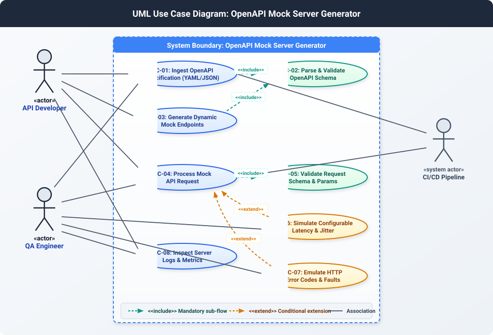
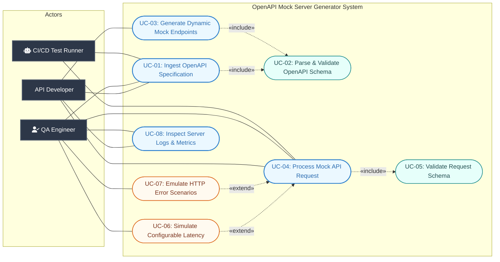
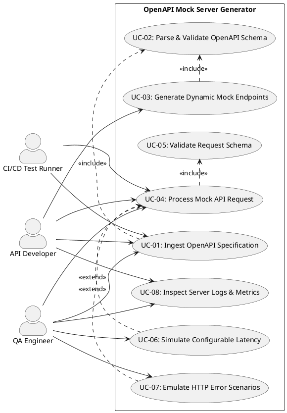

# UML Use-Case Diagram Specification

**Project Title:** OpenAPI Mock Server Generator  
**Problem Statement ID:** #41  
**Domain:** Developer Tools & IT Operations  
**Target Stakeholders / Actors:** API Developer, QA Engineer  

---

## 1. Actors Description

| Actor | Type | Description |
| :--- | :--- | :--- |
| **API Developer** | Primary Human Actor | Builds frontend or client services and relies on mock REST endpoints to develop against unreleased or work-in-progress backend APIs without blocking development. |
| **QA Engineer** | Primary Human Actor | Designs automated API test suites, validates boundary conditions, configures latency, tests error resilience (4xx/5xx responses), and verifies contract compliance. |
| **CI/CD Test Runner** | Secondary System Actor | Automated pipeline that spins up ephemeral mock server instances during automated unit, integration, and end-to-end regression test runs. |

---

## 2. UML Use-Case Diagram (Visual Representation)

Below is the rendered UML Use Case Diagram illustrating all actors, primary use cases, system boundaries, and mandatory **«include»** and **«extend»** relationships.

---

## 3. Mermaid UML Use-Case Diagram

---

## 4. Stereotype Relationships Explanation

### 1. «include» Relationships (Mandatory Sub-flows)
1. **`UC-01 / UC-03` «include» `UC-02: Parse & Validate OpenAPI Schema`**:
   - **Rationale:** The system cannot generate mock endpoints or register routes without first parsing the OpenAPI YAML/JSON document and validating its syntax and schema rules. Parsing and validation is an unconditional, mandatory sub-flow.
2. **`UC-04: Process Mock API Request` «include» `UC-05: Validate Request Schema`**:
   - **Rationale:** Whenever a client sends an HTTP request to a dynamic mock endpoint, the system unconditionally validates incoming query params, path variables, and body payloads against the defined schema constraints.

### 2. «extend» Relationships (Optional / Conditional Extensions)
1. **`UC-06: Simulate Configurable Latency` «extend» `UC-04: Process Mock API Request`**:
   - **Extension Point:** `Response Latency Injection`
   - **Condition:** Executed only when artificial delay/latency rules (e.g., fixed delay, jitter, rate-throttling) are explicitly configured for the endpoint or mock server instance.
2. **`UC-07: Emulate HTTP Error Scenarios` «extend» `UC-04: Process Mock API Request`**:
   - **Extension Point:** `Fault Injection & Status Overrides`
   - **Condition:** Executed only when the incoming request specifies scenario triggers (e.g., `X-Mock-Status: 500` or `X-Mock-Scenario: ServiceUnavailable`) or when failure probability rules are activated by the QA engineer.

---

## 5. PlantUML Source Code

For reference or generation via PlantUML tools:

