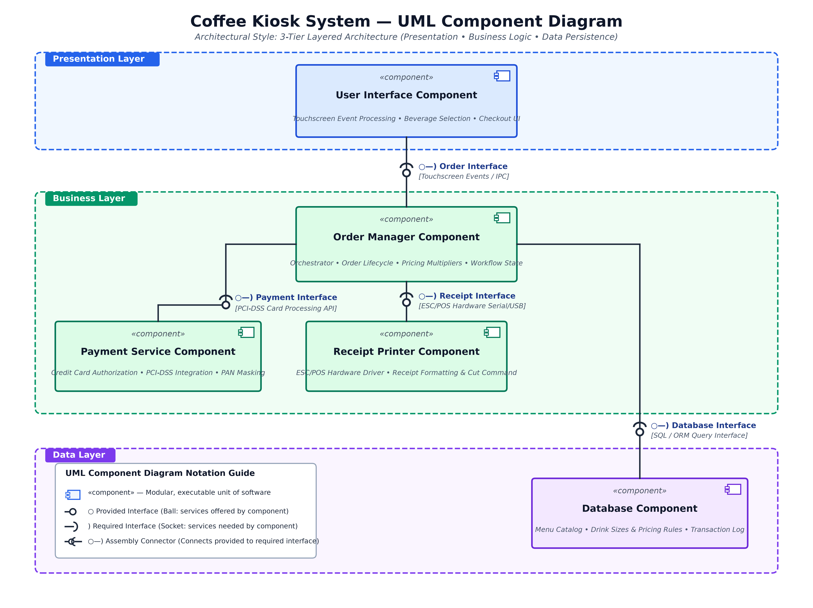

# Lab 3: Component Modelling & Architectural Pattern Selection

**Course:** Software Engineering (SELABS)  
**Student:** A R Akshay Kumar  
**USN:** PES1UG24CS705  
**Assigned Scenario:** Self-Service Coffee Kiosk System  
**Selected Architectural Style:** 3-Tier Layered Architecture (Presentation, Business, Data)

---

## 1. Executive Summary

This repository contains the complete deliverables for **Lab 3: Component Modelling & Architectural Pattern Selection**. The objective is to evaluate different software architectural styles, select the optimal style for an interactive **Self-Service Coffee Kiosk System** in a busy café, design a standard UML 2.0 Component Diagram with provided/required interfaces, and document the architectural justification.

### Scenario Requirements & Constraints:
- **Core Functionality:**
  - Customers select from 3 coffee types: **Espresso**, **Americano**, **Latte**.
  - Customers choose between 2 drink sizes: **Small**, **Large**.
  - Customers pay via **Credit Card only**.
  - System prints paper **Receipts** with complete order and payment details.
- **Technical Constraints:**
  - Handles touchscreen graphical user interface interactions.
  - Connects to physical thermal receipt printer hardware via hardware drivers (ESC/POS).
  - Stores dynamic menu catalog data, drink size pricing multipliers, and order audit transactions.

---

## 2. Architectural Pattern Selection

> ### Architecture Selection Statement:
> *"We chose **Layered Architecture** for the Self-Service Coffee Kiosk System."*

```
+---------------------------------------------------------------+
|                      Presentation Layer                       |
|   - User Interface Component (Touchscreen GUI / Selection)    |
+-------------------------------+-------------------------------+
                                |  ○—) Order Interface
+-------------------------------v-------------------------------+
|                        Business Layer                         |
|   - Order Manager Component (Workflow / Pricing Orchestrator) |
|   - Payment Service Component (Credit Card / PCI-DSS Gateway) |
|   - Receipt Printer Component (ESC/POS Hardware Protocol)     |
+-------------------------------+-------------------------------+
                                |  ○—) Database Interface
+-------------------------------v-------------------------------+
|                          Data Layer                           |
|   - Database Component (Menu Catalog / Pricing / Orders Table)|
+---------------------------------------------------------------+
```

### Justification Highlights:
1. **Decoupling Hardware Peripherals & Device Drivers:** Cleanly isolates touch screen events and ESC/POS thermal printer hardware from business logic. Upgrading hardware peripherals requires no changes to pricing or order management algorithms.
2. **Independent Menu & Pricing Administration:** Café menu items, beverage descriptions, and size pricing multipliers can be modified in the Data Layer without redeploying the UI or payment services.
3. **Security Advantage (PCI-DSS Cardholder Data Isolation):** The touch screen presentation tier never directly communicates with banking networks or storage. Cardholder PANs are processed in an isolated business component, securely encrypted in transit, and never stored unencrypted on local disks.
4. **Performance Benefit (In-Memory Caching & Sub-Second Latency):** The Order Manager caches active menu items and pricing tables in-memory upon kiosk startup. Customer touch interactions receive instantaneous sub-10ms UI responses during peak café rush hours.

---

## 3. UML Component Diagram

The UML Component Diagram conforms strictly to UML 2.0 standards, displaying **5 components** across **3 horizontal layers** interconnected via **4 ball-and-socket assembly interfaces**.



### Component Specifications:

| Layer | Component Name | Stereotype | Primary Responsibilities |
| :--- | :--- | :--- | :--- |
| **Presentation** | `User Interface Component` | `«component»` | Handles touchscreen event capture, beverage and size menu display, checkout prompts, and virtual receipt preview. |
| **Business** | `Order Manager Component` | `«component»` | Central orchestrator managing order lifecycle state machines, calculating total prices with drink size multipliers, and delegating to payment and printer services. |
| **Business** | `Payment Service Component` | `«component»` | Encapsulates credit card validation (Luhn check, expiry, CVV), PCI-DSS payment gateway tokenization, and card masking (`**** **** **** 1234`). |
| **Business** | `Receipt Printer Component` | `«component»` | Translates order and authorization summaries into hardware-compatible ESC/POS print jobs and issues cut commands. |
| **Data** | `Database Component` | `«component»` | Persists the coffee menu catalog, size pricing multipliers, and transactional audit logs using SQLite / Relational schema. |

### Interface Specifications:

| Interface Name | Provided By (Ball `○`) | Required By (Socket `)`) | Protocol / Technology | Description |
| :--- | :--- | :--- | :--- | :--- |
| **Order Interface** | `Order Manager Component` | `User Interface Component` | Touchscreen Events / IPC | Passes selected coffee type and drink size; returns order ID and status. |
| **Payment Interface** | `Payment Service Component` | `Order Manager Component` | PCI-DSS Card Processing API | Receives payment authorization requests; returns approval code or rejection reason. |
| **Receipt Interface** | `Receipt Printer Component` | `Order Manager Component` | ESC/POS Hardware Serial/USB | Receives formatted order payload; prints physical paper customer receipt. |
| **Database Interface** | `Database Component` | `Order Manager Component` | SQL / ORM Query Interface | Fetches menu items, size price rules, and logs completed/failed orders. |

---

## 4. Deliverable Files

All required lab deliverables are generated and included in this repository:

1. **UML Component Diagram:**
   - [`Coffee_Kiosk_Component_Diagram.png`](Coffee_Kiosk_Component_Diagram.png) — High-resolution 300 DPI image
   - [`Coffee_Kiosk_Component_Diagram.pdf`](Coffee_Kiosk_Component_Diagram.pdf) — Vector-rendered PDF
   - [`Coffee_Kiosk_Component_Diagram.svg`](Coffee_Kiosk_Component_Diagram.svg) — Scalable vector graphic
   - [`Coffee_Kiosk_Component_Diagram.drawio`](Coffee_Kiosk_Component_Diagram.drawio) — Native editable draw.io / diagrams.net XML
2. **Written Justification Document:**
   - [`Coffee_Kiosk_Architecture_Justification.docx`](Coffee_Kiosk_Architecture_Justification.docx) — Formal Word document (1 page max)
   - [`Coffee_Kiosk_Architecture_Justification.pdf`](Coffee_Kiosk_Architecture_Justification.pdf) — Formatted printable PDF (1 page max)
3. **Executable Architecture Prototype:**
   - [`src/coffee_kiosk_system.py`](src/coffee_kiosk_system.py) — Modular Python simulation demonstrating the 5 components and 4 interfaces in action.

---

## 5. Verification & Testing

The Python simulation models the component interactions, database persistence, payment verification, and thermal receipt output:

```bash
python3 src/coffee_kiosk_system.py
```

### Sample Output:
```text
============================================================
Lab 3: Architectural Pattern Selection & Component Modelling
System: Self-Service Coffee Kiosk System
Architecture: 3-Tier Layered Architecture
============================================================

=======================================================
  ☕  WELCOME TO CAFE CENTRAL SELF-SERVICE KIOSK  ☕
=======================================================
 Available Beverages:
  [1] Espresso   - Rich, concentrated shot of espresso
      Small: $3.00  |  Large: $4.20
  [2] Americano  - Espresso diluted with hot water
      Small: $3.75  |  Large: $5.25
  [3] Latte      - Espresso with steamed milk and light foam
      Small: $4.50  |  Large: $6.30
=======================================================

[Touch Interaction] User selected: Americano (Large)
[Touch Screen] Order created #K0101 | Total: $5.25
[Touch Screen] Entering Payment Details (Card: **** 4444)
Result: Order #K0101 completed successfully!

[Receipt Printer Hardware Output]:
==========================================
          CAFE CENTRAL KIOSK              
       SELF-SERVICE ORDER RECEIPT         
==========================================
 Order Number : #K0101
 Date & Time  : 2026-09-10 21:52:30
------------------------------------------
 ITEM                 SIZE      PRICE ($)
------------------------------------------
 Americano            Large          5.25
------------------------------------------
 TOTAL AMOUNT:                 $    5.25
==========================================
 PAYMENT METHOD: Credit Card Only
 Card Number   : ****-****-****-4444
 Auth Code     : AUTH-215230-4444
 Payment Status: SUCCESS / PAID
==========================================
       Thank you for your order!          
       Please collect at counter.         
==========================================
```
